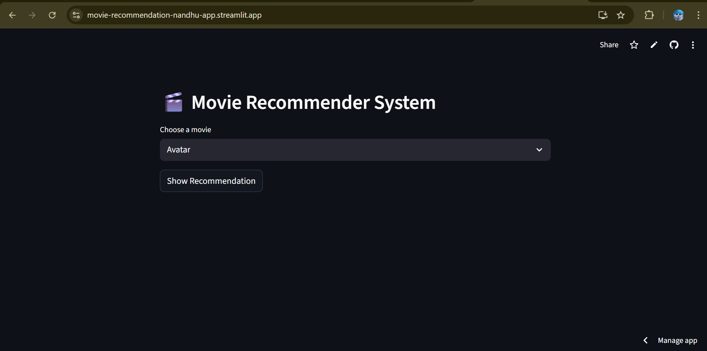
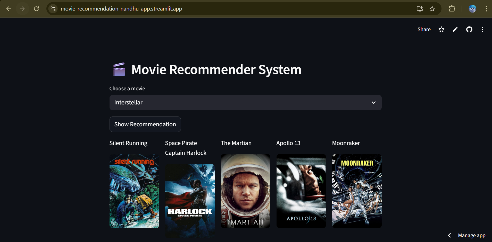

# 🎬 Movie Recommender System

A personalized movie recommendation web app built using **Python**, **Machine Learning**, and **Streamlit**.  
It suggests the top 5 most similar movies based on the selected movie and also fetches **real movie posters** using the TMDB API.

🔥 **Live Demo:**  
👉 https://movie-recommendation-nandhu-app.streamlit.app/

---

## 🚀 Features

- ✅ Content-based movie recommendation  
- ✅ Shows **movie posters** using TMDB API  
- ✅ Clean, fast, and responsive UI using Streamlit  
- ✅ Deployed using Streamlit Cloud  
- ✅ Uses optimized + compressed similarity matrix  
- ✅ Works instantly in the browser

---

## 🧠 How It Works

1. A movie is selected from the dropdown  
2. The app calculates similarity using:
   - Movie genres  
   - Keywords  
   - Overview  
   - Cast  
   - Crew  

3. The top 5 most similar movies are fetched  
4. Posters are retrieved using **TMDB API**  
5. Output is displayed in beautiful columns

---

## 🛠️ Tech Stack

| Technology | Purpose |
|-----------|---------|
| **Python** | Backend logic |
| **Pandas** | Data handling |
| **NumPy** | Matrix operations |
| **Scikit-learn** | Vectorization & similarity |
| **Streamlit** | Web UI |
| **TMDB API** | Movie posters |
| **Pickle + gzip** | Model + compressed similarity matrix |

---

## 📂 Project Structure
```
movie_recommender_system/
│
├── 🧩 app.py 
├── 📚 movie_dict.pkl 
├── 🗜️ similarity_final.pkl.gz 
├── 📦 requirements.txt 
└── 📝 README.md 
```

---

## 🧰 Installation (Run Locally)

### 1️⃣ Clone the repository
```bash
git clone https://github.com/imNandini19/movie_recommender_system.git
cd movie_recommender_system
```
### 2️⃣ Install dependencies
```
pip install -r requirements.txt
```

#### 3️⃣ Run the Streamlit app
```
streamlit run app.py
```

## 🌐 Deployment

This project is deployed using Streamlit Cloud, which allows instant hosting with GitHub integration.


### 🔑 API Key Setup

``` This project uses TMDB API to fetch posters.
You can get your API key here: https://www.themoviedb.org/documentation/api

Replace the API key inside fetch_poster() in app.py:

api_key = "YOUR_API_KEY" 
```

### 📸 Screenshots

#### 🎥 Home Page


#### 🔍 Demo Search



### ⭐ Support & Contributions

```
If you like this project, please ⭐ star the repository — it helps a lot!

Pull requests, suggestions, and improvements are always welcome.
```

#### 👩‍💻 Author: Nandini Mamillapalli

#### 🔗 GitHub: https://github.com/imNandini19

